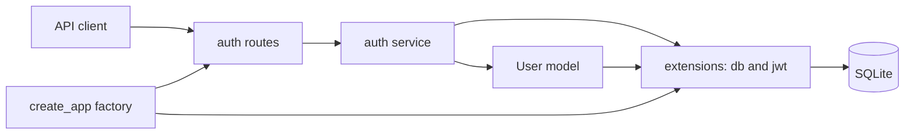

# DigiMarket API

DigiMarket is an API-only Flask e-commerce project. M0 and M1 are implemented: the application
factory, SQLite configuration, user registration, and JWT login work. Product and order endpoints
remain planned work for M2 and M3.

## Start the application

Run the application from the `python/` directory.

1. Install the locked dependencies:

   ```bash
   uv sync
   ```

2. Create `.env` with the two required, non-empty settings:

   ```dotenv
   DATABASE_PATH=/absolute/path/to/digimarket.db
   JWT_SECRET_KEY=replace-with-a-long-private-secret
   ```

   `DATABASE_PATH` is the only supported database setting. It is converted to a SQLite URL by the
   application; `DATABASE_URL` is intentionally not supported. For a registration demo that should
   not modify the supplied database, copy `digimarket.db` and point `DATABASE_PATH` to that copy.

3. Start Flask:

   ```bash
   uv run flask run --debug
   ```

   Flask discovers the `app` package and its `create_app` factory automatically. The Flask CLI loads
   `.env` before creating the application.

## Implemented API

All implemented endpoints accept and return JSON.

### Register a client

`POST /api/auth/register`

| Request field | Rule |
| --- | --- |
| `email` | Required nonblank string; trimmed, lowercased, validated, and unique. |
| `nom` | Required nonblank string; trimmed before storage. |
| `mot_de_passe` | Required string with at least eight characters. |

Registration always creates a user with role `client`; an optional supplied `role` field does not
grant administrator access. The raw password is never stored. Its generated hash is written to
`user.password_hash`.

On success, the endpoint returns `201 Created` with these public fields: `id`, `email`, `nom`,
`role`, and `date_creation`. `date_creation` is serialized as an ISO 8601 UTC timestamp. Password
fields are never included.

Invalid input returns JSON `400`; an email that already exists after normalization returns JSON
`409`.

### Log in

`POST /api/auth/login`

| Request field | Rule |
| --- | --- |
| `email` | Required nonblank string; trimmed, lowercased, and validated. |
| `mot_de_passe` | Required nonblank string. |

On success, the endpoint returns `200 OK` with one field: `access_token`.

The JWT contains the standard subject claim, `sub`, set to the user ID as text, and a custom `role`
claim. Login returns the same JSON `401` error for an unknown email and a wrong password. This avoids
revealing whether an account exists. Malformed input returns JSON `400`.

No protected product or order endpoint exists yet; the token is prepared for M2 and M3 authorization.

### Try registration and login

With the server running, set its base URL once:

```bash
API_URL=http://127.0.0.1:5000
```

Register a client. Replace the placeholder values with your own values; the password must contain at
least eight characters.

```bash
curl --include --request POST "$API_URL/api/auth/register" \
  --header "Content-Type: application/json" \
  --data '{
    "email": "your-email@example.com",
    "nom": "Your Name",
    "mot_de_passe": "replace-with-a-secure-password"
  }'
```

Log in with the same credentials:

```bash
curl --include --request POST "$API_URL/api/auth/login" \
  --header "Content-Type: application/json" \
  --data '{
    "email": "your-email@example.com",
    "mot_de_passe": "replace-with-a-secure-password"
  }'
```

The login response contains `access_token`. Keep it only for the current local session; M2 and M3
will add routes that send it in an `Authorization: Bearer <token>` header.

### Error responses

Endpoint validation and authentication failures use this shape:

```json
{"error": "Human-readable explanation."}
```

The application factory also converts framework-level `404` and `405` failures to JSON and returns a
non-leaking JSON `500` response for unexpected request-processing errors. These handlers are shared
API infrastructure, not M1 authentication endpoint requirements.

## Current structure



| Location | Responsibility |
| --- | --- |
| `app/__init__.py` | Creates the Flask app, loads configuration, initializes extensions, registers Blueprints and shared error handlers. |
| `app/extensions.py` | Owns unbound SQLAlchemy and JWT extension objects. |
| `app/config.py` | Reads and validates required environment configuration. |
| `app/auth/routes.py` | Translates HTTP JSON requests and service errors into HTTP responses. |
| `app/auth/service.py` | Validates input, registers users, authenticates credentials, and creates tokens. |
| `app/models/user.py` | Maps the existing `user` SQLite table and creates safe public representations. |
| `tests/` | Uses a fresh temporary SQLite database for every test. |

Feature modules import database and JWT objects from `app.extensions`, never from the application
factory. This keeps the dependency direction one-way and prevents circular imports.

## Verify the project

Run the checks from `python/`:

```bash
uv run pytest
uv run ruff format --check app tests
uv run ruff check app tests
uv run mypy app
uvx ty check app tests
```

The current suite contains 20 tests. Its nine M1 authentication cases cover successful and invalid
registration/login, duplicate normalized emails, generic failed credentials, and recovery from a
database uniqueness race.

When dependencies change, use `uv add <package>` for runtime dependencies, `uv add --dev <package>`
for development dependencies, and `uv remove <package>` to remove one. These commands update
`pyproject.toml` and `uv.lock`; commit those files together.

## Documentation

- [Current roadmap and implementation design](docs/DESIGN.md)
- [Supplied project description](docs/DESCRIPTION.md)
- [Supplied data structures](docs/STRUCTURE-DES-DONNEES.md)
- [Supplied milestone progression](docs/PROGRESSION.md)
