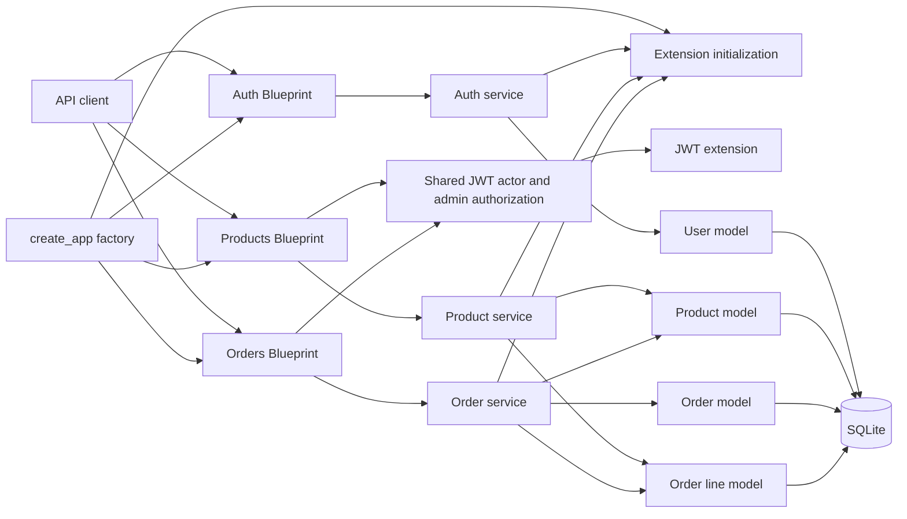

# DigiMarket API

DigiMarket is an API-only Flask e-commerce project. M0 through M3 are implemented: the application
factory, SQLite configuration, user registration, JWT login, product catalogue, and orders work.

## Start the application

Run the application from the `python/` directory.

1. Install the locked dependencies:

   ```bash
   uv sync
   ```

2. Create `.env` with the two required, non-empty settings:

   ```dotenv
   DATABASE_PATH=/absolute/path/to/digimarket.db
   JWT_SECRET_KEY=replace-with-a-long-private-secret
   ```

   `DATABASE_PATH` is the only supported database setting. It is converted to a SQLite URL by the
   application; `DATABASE_URL` is intentionally not supported. For a registration demo that should
   not modify the supplied database, copy `digimarket.db` and point `DATABASE_PATH` to that copy.

3. Start Flask:

   ```bash
   uv run flask run --debug
   ```

   Flask discovers the `app` package and its `create_app` factory automatically. The Flask CLI loads
   `.env` before creating the application.

## Implemented API

All implemented endpoints accept and return JSON.

### Register a client

`POST /api/auth/register`

| Request field | Rule |
| --- | --- |
| `email` | Required nonblank string; trimmed, lowercased, validated, and unique. |
| `nom` | Required nonblank string; trimmed before storage. |
| `mot_de_passe` | Required string with at least eight characters. |

Registration always creates a user with role `client`; an optional supplied `role` field does not
grant administrator access. The raw password is never stored. Its generated hash is written to
`user.password_hash`.

On success, the endpoint returns `201 Created` with these public fields: `id`, `email`, `nom`,
`role`, and `date_creation`. `date_creation` is serialized as an ISO 8601 UTC timestamp. Password
fields are never included.

Invalid input returns JSON `400`; an email that already exists after normalization returns JSON
`409`.

### Log in

`POST /api/auth/login`

| Request field | Rule |
| --- | --- |
| `email` | Required nonblank string; trimmed, lowercased, and validated. |
| `mot_de_passe` | Required nonblank string. |

On success, the endpoint returns `200 OK` with one field: `access_token`.

The JWT contains the standard subject claim, `sub`, set to the user ID as text, and a custom `role`
claim. Login returns the same JSON `401` error for an unknown email and a wrong password. This avoids
revealing whether an account exists. Malformed input returns JSON `400`.

Product writes and order status updates use the token for administrator authorization. Order reads
and creation also require a token.

### Product catalogue

The product catalogue is available at `/api/produits`. Listing and detail reads are public; product
creation, replacement, and deletion require `Authorization: Bearer <token>` from an administrator.
The five routes are:

| Method | Path | Access | Purpose |
| --- | --- | --- | --- |
| `GET` | `/api/produits` | Public | List products, optionally filtered by `q`. |
| `GET` | `/api/produits/{id}` | Public | Return one product. |
| `POST` | `/api/produits` | Administrator | Create a product. |
| `PUT` | `/api/produits/{id}` | Administrator | Fully replace a product. |
| `DELETE` | `/api/produits/{id}` | Administrator | Delete a product. |

The optional `q` query parameter is trimmed and performs a case-insensitive partial, literal search
over `nom`, `description`, and `categorie`. Create and `PUT` requests require all five editable
fields: `nom`, `description`, `categorie`, `prix`, and `quantite_stock`. Text values must be
nonblank, `prix` must be a positive number, and `quantite_stock` must be a non-negative integer
representable by SQLite. `date_creation` is generated by the server and is not an editable field.

Invalid product input returns JSON `400`. Missing or malformed authentication returns JSON `401`,
and a valid client token returns JSON `403`. A missing product returns JSON `404`. Successful
deletion returns `200` with `{"message": "Product deleted."}`. Before deletion, any reference from
a non-pending order (`validée`, `expédiée`, `annulée`, or a null/unknown status) returns JSON `409`
without changing the product or any order. If all references are `en_attente`, deletion removes
each complete pending order and all its lines, including lines for other products, then removes the
selected product in one transaction. Stock does not change. A client requesting a removed pending
order later receives JSON `404`. This cleanup sends no notification, creates no archive, and
requires no schema change. A future `TODO(M4)` considers a product lifecycle policy that could
retain pending orders instead.

### M2 implementation lessons

- The `Product` model mirrors the supplied SQLite schema, where `description` and `quantite_stock`
  may be null. The product API has a stricter rule: every create or `PUT` request must provide all
  five editable fields. Mapping an existing database and validating new API input are separate jobs.
- Product routes handle HTTP concerns only: read JSON, call a service, and return a status and JSON
  response. `ProductData` carries validated values from the route to the service; the service owns
  validation, search, and persistence.
- `admin_required` calls `verify_jwt_in_request()` before reading the JWT `role` claim. Shared JWT
  callbacks provide JSON `401` responses, while a valid non-admin token receives `403`.
- `PUT` is deliberately a full replacement. A partial update is rejected; a future partial-update
  feature would use `PATCH` with its own validation rules.

With the server running, public catalogue requests need no token:

```bash
API_URL=http://127.0.0.1:5000
curl --include "$API_URL/api/produits"
curl --include "$API_URL/api/produits?q=ergonomic%20mouse"
curl --include "$API_URL/api/produits/1"
```

### Orders

Every order route requires `Authorization: Bearer <token>`. Authenticated users can create orders;
clients read their own orders and lines. Administrators can read all orders and lines and are the
only users who can change an order's status.

| Method | Path | Access | Purpose |
| --- | --- | --- | --- |
| `GET` | `/api/commandes` | Authenticated user | List visible orders. |
| `GET` | `/api/commandes/{id}` | Owner or administrator | Return one order. |
| `POST` | `/api/commandes` | Authenticated user | Create an `en_attente` order. |
| `PATCH` | `/api/commandes/{id}` | Administrator | Change status with `{"statut": "validée"}`, for example. |
| `GET` | `/api/commandes/{id}/lignes` | Owner or administrator | Return saved product lines and prices. |

Creation requires a nonblank `adresse_livraison` and a nonempty `lignes` list. Each line contains
exactly `produit_id` and a positive integer `quantite`; a product can appear only once per order.
The server copies each product's current full `prix` into the line's `prix_unitaire`. A supplied
price or other extra field is rejected with `400`. Creation checks stock but leaves it available:
an `en_attente` order does not reserve or decrement stock.

The exact statuses are `en_attente`, `validée`, `expédiée`, and `annulée`. Administrators can move
`en_attente` to `validée` or `annulée`, and `validée` to `expédiée` or `annulée`. The last two statuses
are terminal. Validation checks every line and decrements all product stocks in one transaction;
canceling a validated order restores those quantities. If any line lacks stock at validation, the
whole update fails and all stock values and the order status stay unchanged.

Invalid creation or status JSON returns `400`; missing or invalid authentication returns `401`.
Reading another client's order or attempting a client status update returns `403`. A missing order
or ordered product returns `404`; this includes a pending order removed during product deletion.
Insufficient stock or a disallowed status transition returns `409`. Errors use the JSON `error`
field shown below.

With the server running, use a product ID returned by the catalogue and paste the `access_token`
from the login example below. These are local session placeholders, not production credentials:

```bash
API_URL=http://127.0.0.1:5000
CLIENT_TOKEN='paste-client-access_token-here'
PRODUCT_ID=1 # replace with an available catalogue product ID
curl --include --request POST "$API_URL/api/commandes" \
  --header "Authorization: Bearer $CLIENT_TOKEN" \
  --header "Content-Type: application/json" \
  --data "{\"adresse_livraison\":\"10 rue Exemple\",\"lignes\":[{\"produit_id\":$PRODUCT_ID,\"quantite\":1}]}"
curl --include --header "Authorization: Bearer $CLIENT_TOKEN" "$API_URL/api/commandes"
```

An administrator can use the `id` from the creation response to validate that order:

```bash
ADMIN_TOKEN='paste-admin-access_token-here'
ORDER_ID=1 # replace with the created order ID
curl --include --request PATCH "$API_URL/api/commandes/$ORDER_ID" \
  --header "Authorization: Bearer $ADMIN_TOKEN" \
  --header "Content-Type: application/json" \
  --data '{"statut":"validée"}'
```

### M3 implementation lessons

- An order line is a saved record, not a live product view: its `prix_unitaire` remains the price at
  creation even when the catalogue price later changes.
- Routes adapt HTTP and JWT data; the order service receives the actor ID and role explicitly, so
  ownership, stock, and status rules are testable without a request.
- A stock-changing transition is all-or-nothing within its database transaction. It does not yet
  provide cross-session stock locking; that is future work if simultaneous validation becomes a
  requirement.

### Try registration and login

With the server running, set its base URL once:

```bash
API_URL=http://127.0.0.1:5000
```

Register a client. Replace the placeholder values with your own values; the password must contain at
least eight characters.

```bash
curl --include --request POST "$API_URL/api/auth/register" \
  --header "Content-Type: application/json" \
  --data '{
    "email": "your-email@example.com",
    "nom": "Your Name",
    "mot_de_passe": "replace-with-a-secure-password"
  }'
```

Log in with the same credentials:

```bash
curl --include --request POST "$API_URL/api/auth/login" \
  --header "Content-Type: application/json" \
  --data '{
    "email": "your-email@example.com",
    "mot_de_passe": "replace-with-a-secure-password"
  }'
```

The login response contains `access_token`. This walkthrough registers and logs in a client, so the
token has the `client` role and cannot manage products or order statuses. Keep it only for the
current local session; administrator writes require an existing administrator token in an
`Authorization: Bearer <token>` header. Administrator seeding is deferred to M4.

### Error responses

Endpoint validation and authentication failures use this shape:

```json
{"error": "Human-readable explanation."}
```

The application factory also converts framework-level `404` and `405` failures to JSON and returns a
non-leaking JSON `500` response for unexpected request-processing errors. These handlers are shared
API infrastructure, not M1 authentication endpoint requirements.

## Current structure



| Location | Responsibility |
| --- | --- |
| `app/__init__.py` | Creates the Flask app, loads configuration, initializes extensions, registers Blueprints and shared error handlers. |
| `app/extensions.py` | Owns unbound SQLAlchemy and JWT extension objects. |
| `app/config.py` | Reads and validates required environment configuration. |
| `app/auth/routes.py` | Translates HTTP JSON requests and service errors into HTTP responses. |
| `app/auth/service.py` | Validates input, registers users, authenticates credentials, and creates tokens. |
| `app/models/user.py` | Maps the existing `user` SQLite table and creates safe public representations. |
| `app/products/routes.py` | Exposes public catalogue reads and administrator-only product writes. |
| `app/products/service.py` | Validates complete product payloads, searches products, and persists product changes. |
| `app/models/product.py` | Maps the existing `product` SQLite table and serializes product data. |
| `app/orders/routes.py` | Exposes authenticated order creation and reads, plus administrator status updates. |
| `app/orders/service.py` | Validates orders and transitions, checks access and stock, and persists changes. |
| `app/models/order.py`, `app/models/order_item.py` | Map order headers and lines from the existing SQLite tables. |
| `app/auth/authorization.py` | Provides JWT actor extraction, shared errors, and administrator-role authorization. |
| `tests/` | Uses a fresh temporary SQLite database for every test. |

Feature modules import database and JWT objects from `app.extensions`, never from the application
factory. This keeps the dependency direction one-way and prevents circular imports.

## Verify the project

Run the checks from `python/`:

```bash
uv run pytest
uv run ruff format --check app tests
uv run ruff check app tests
uv run mypy app
uvx ty check app tests
```

The combined suite exercises factory/configuration behavior, database isolation, authentication,
product management, order ownership and creation, saved prices, stock transitions, and errors.

When dependencies change, use `uv add <package>` for runtime dependencies, `uv add --dev <package>`
for development dependencies, and `uv remove <package>` to remove one. These commands update
`pyproject.toml` and `uv.lock`; commit those files together.

## Documentation

- [Current roadmap and implementation design](docs/DESIGN.md)
- [Supplied project description](docs/DESCRIPTION.md)
- [Supplied data structures](docs/STRUCTURE-DES-DONNEES.md)
- [Supplied milestone progression](docs/PROGRESSION.md)
